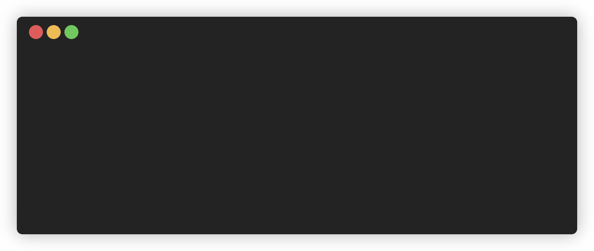

# Pod watcher

Kubernetes has a metrics server that provides CPU and memory usage statistics for pods. By default, these metrics are collected every 60 seconds. This interval can be adjusted using the --metric-resolution flag. However, it is not recommended to set values below 15 seconds, as this is the resolution of metrics calculated by Kubelet ([reference1]((https://github.com/kubernetes-sigs/metrics-server/blob/master/docs/command-line-flags.txt#L9)), [reference2](https://github.com/kubernetes-sigs/metrics-server/blob/master/FAQ.md#how-often-metrics-are-scraped)).

To monitor CPU and memory usage and log the peak usage of pods, I created this tool.

## Demo


You can view the results similar to `kubectl top pod`.
```bash
NAME     CPU(cores)     MEMORY(bytes)
wren     13m            1450Mi
```

## How to install
- Requirement node 17
- Clone repo
- Install dependencies
   ```bash
   npm install
   ```

## How to use
```bash
npm start
```
If you want to use this anywhere, you can install it globally.
```bash
npm install -g
```
You can run `pod-watcher` directly in the terminal from anywhere to start this tool.

